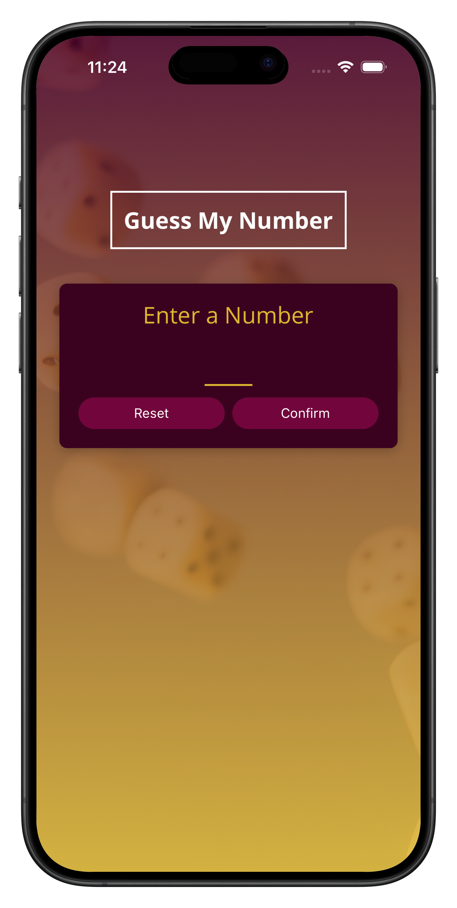
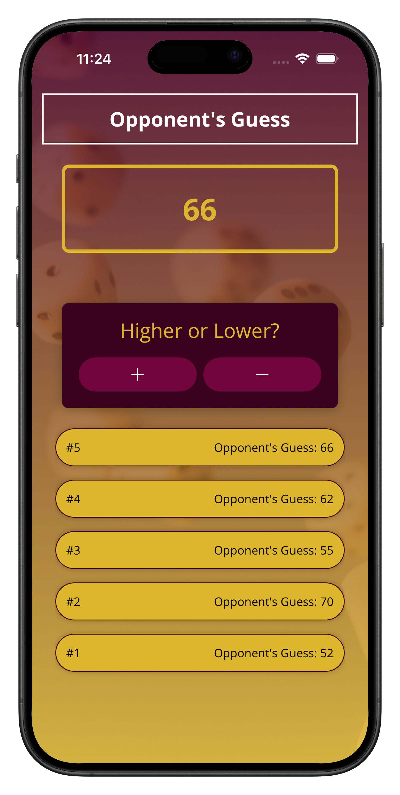
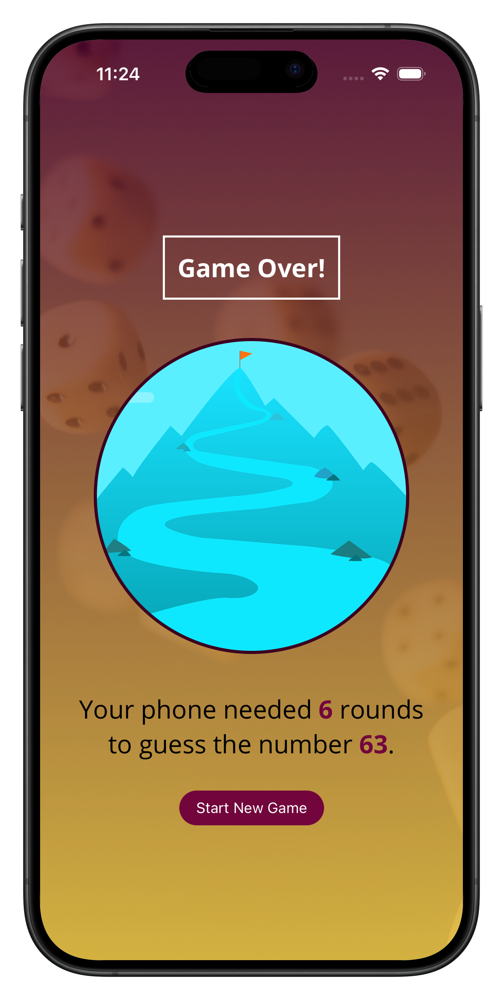
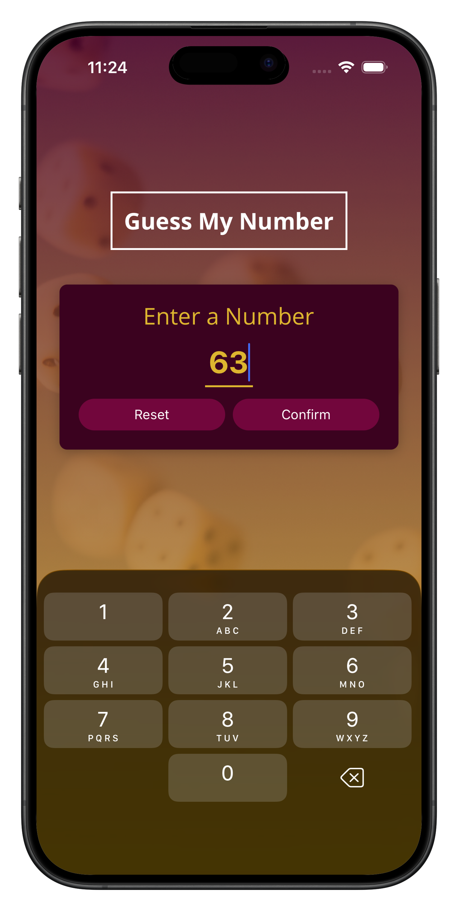
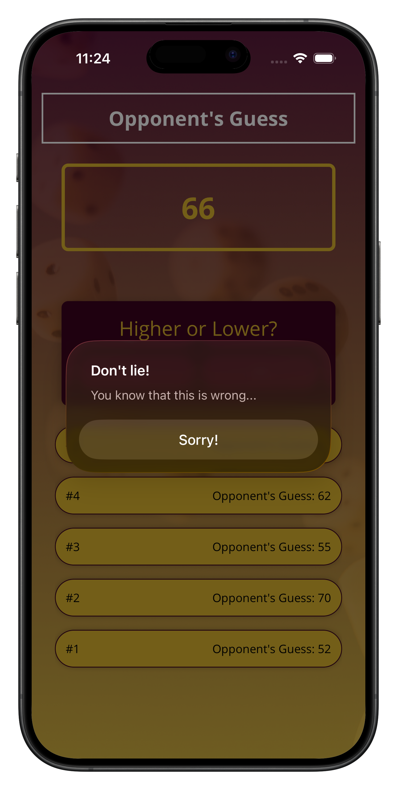

# 🎮 Guess The Number

> A clever React Native game where you think of a number and the app intelligently guesses it

[](https://reactnative.dev)
[](https://www.javascript.com)
[](https://opensource.org/licenses/MIT)
[](https://reactnative.dev)

---

## 🎯 Overview

**Guess The Number** is an engaging mind game that flips the script on traditional guessing games. Instead of you guessing a number, the app tries to guess _your_ number using a smart binary search algorithm. Provide simple feedback—higher, lower, or correct—and watch as the app intelligently narrows down the possibilities to reveal your secret number.

Perfect for quick entertainment and demonstrating algorithmic thinking in an interactive, user-friendly interface.

---

## 📸 Screenshots

<div align="center">

|                  Home Screen                   |                      Game Screen                      |                     Game Over Screen                     |
| :--------------------------------------------: | :---------------------------------------------------: | :------------------------------------------------------: |
|  |  |  |

**Additional Screens**

|                        Home with Number                         |                     User Lied                     |
| :-------------------------------------------------------------: | :-----------------------------------------------: |
|  |  |

</div>

---

## ✨ Features

### 🎮 Core Gameplay

- **Intuitive Number Guessing**: Think of any number between 1-100, and let the app guess it
- **Smart Algorithm**: Uses binary search logic for efficient number prediction
- **Interactive Feedback**: Simple tap-based controls for higher/lower/correct responses
- **Round Tracking**: Displays the number of attempts needed to find your number
- **Instant Replay**: Start a new game anytime with a single tap

### 🎨 UI/UX Highlights

- **Clean & Modern Design**: Minimalist interface focused on gameplay
- **Responsive Layout**: Optimized for all device sizes
- **Smooth Animations**: Visual feedback for user interactions
- **Color-Coded Interface**: Intuitive visual hierarchy and clear call-to-action buttons
- **Accessible Typography**: Easy-to-read fonts and contrast ratios

### 📱 Platform Compatibility

- **iOS**: Fully optimized for iPhone and iPad
- **Android**: Seamless experience on all Android devices
- **Cross-Platform**: Single codebase runs on both platforms

---

## 🛠️ Tech Stack

| Technology            | Purpose                                |
| :-------------------- | :------------------------------------- |
| **React Native**      | Cross-platform mobile app framework    |
| **JavaScript (ES6+)** | Primary programming language           |
| **React Hooks**       | State management (useState, useEffect) |
| **React Navigation**  | Screen navigation and flow             |
| **Native Components** | Platform-specific UI elements          |

---

## 📁 Project Structure

```
GuessTheNumber/
├── App.js                    # Entry point & navigation setup
├── app.json                  # App configuration & metadata
├── package.json              # Dependencies & scripts
├── babel.config.js           # Babel transpiler configuration
│
├── screens/                  # Application screens
│   ├── GameStartScreen.js   # Welcome & game setup screen
│   ├── GameScreen.js        # Main guessing game screen
│   └── GameOverScreen.js    # Results & replay screen
│
├── components/               # Reusable UI components
│   ├── ui/                  # Presentational components
│   │   ├── Card.js         # Flexible container component
│   │   ├── PrimaryButton.js # Main action button
│   │   └── Title.js        # Heading component
│   │
│   └── game/                # Game-specific components
│       ├── NumberContainer.js # Displays current guess
│       └── GuessLogItem.js   # Shows guess history
│
├── constants/
│   └── colors.js            # Centralized color palette
│
└── assets/
    ├── images/              # App images & icons
    ├── fonts/               # Custom font files
    └── screenshots/         # App screenshots for README
```

### Folder Explanations

| Folder               | Purpose                                             |
| :------------------- | :-------------------------------------------------- |
| **screens/**         | Page-level components representing full app screens |
| **components/ui/**   | Generic, reusable UI building blocks                |
| **components/game/** | Game-specific presentational components             |
| **constants/**       | App-wide constants (colors, sizes, etc.)            |
| **assets/**          | Static files (images, fonts, screenshots)           |

---

## 🚀 Installation & Setup

### Prerequisites

Ensure you have the following installed:

- **Node.js** (v14 or higher)
- **npm** or **yarn** package manager
- **React Native CLI** or **Expo CLI**
- **Xcode** (for iOS development on macOS)
- **Android Studio** (for Android development)

### Step-by-Step Installation

**1. Clone the repository**

```bash
git clone https://github.com/yourusername/GuessTheNumber.git
cd GuessTheNumber
```

**2. Install dependencies**

```bash
npm install
# or
yarn install
```

**3. Install CocoaPods dependencies (iOS only)**

```bash
cd ios
pod install
cd ..
```

**4. Run on Android**

```bash
npm run android
# or
npx react-native run-android
```

**5. Run on iOS**

```bash
npm run ios
# or
npx react-native run-ios
```

**6. Run with Expo (if available)**

```bash
npx expo start
```

### Development Mode

To start the development server with hot reload:

```bash
npm start
```

Then press:

- `a` for Android
- `i` for iOS
- `w` for web (if supported)

---

## 🎮 How to Play

### Game Flow

1. **Start Screen**

   - Tap "Start Game" to begin
   - Read the instructions carefully

2. **Think of a Number**

   - Mentally choose any number between 1 and 100
   - Don't tell the app—let it guess!

3. **Guide the App**

   - The app makes an intelligent guess
   - Respond with one of three options:
     - **Higher** 🔼 → Your number is higher than the guess
     - **Lower** 🔽 → Your number is lower than the guess
     - **Correct!** ✅ → The app guessed your number

4. **Watch It Learn**

   - The app uses your feedback to narrow the range
   - See the guess history and remaining possibilities
   - Marvel at the algorithm's efficiency!

5. **Game Over**
   - View the number of rounds it took
   - Celebrate if it was quick, or smile if it took longer
   - Tap "New Game" to play again

### Tips for Best Experience

- Think of a real number before starting—consistency matters!
- Answer honestly with your feedback
- Watch how the number range shrinks with each guess

---

## 🧠 Game Logic Overview

### The Guessing Algorithm

The app uses a **binary search algorithm** to find your number efficiently:

```
Algorithm Steps:
1. Initialize range: min = 1, max = 100
2. Calculate midpoint: guess = (min + max) / 2
3. Based on user feedback:
   - "Higher" → Update min = guess + 1
   - "Lower" → Update max = guess - 1
   - "Correct" → Game won!
4. Repeat until correct number is found
```

### State Management

- **Current Guess**: Tracked using React `useState` hook
- **Min/Max Range**: Updated based on user feedback
- **Guess History**: Maintains list of all previous guesses
- **Round Counter**: Increments with each guess

### Component Communication

- **Props**: Data flows down from parent to child components
- **Callbacks**: Child components trigger parent updates via callback functions
- **Context**: Shared game state across screens (if needed)

### Efficiency

With a 100-number range, the algorithm needs **maximum 7 guesses** to find any number—that's the power of binary search!

---

## 🚀 Future Improvements

### 🎬 Animations

- Smooth number transitions during guesses
- Celebration animations on successful guesses
- Subtle scale and fade effects for UI interactions

### 🎚️ Difficulty Levels

- **Easy**: 1-50 range with slower guessing
- **Medium**: 1-100 range (current)
- **Hard**: 1-1000 range for advanced players
- **Custom**: User-defined number ranges

### 🔊 Sound Effects

- Guess notification sounds
- Success fanfare on correct guess
- Subtle feedback tones for button presses
- Toggle sound in settings

### 🧠 AI Enhancements

- Learn from user patterns across multiple games
- Adaptive difficulty that adjusts to player behavior
- Implement minimax algorithm for opponent mode
- Player vs. App competitive mode

### 📊 Statistics & Analytics

- Track games played, win rate, average guesses
- Leaderboard for comparing with friends
- Game statistics dashboard
- Historical data visualization

### 🎨 Theme & Customization

- Dark mode / Light mode toggle
- Custom color themes
- Language localization (multiple languages)

---

## 🤝 Contributing

We welcome contributions from the community! Here's how you can help:

### Fork & Clone

```bash
# Fork the repository on GitHub
# Clone your fork
git clone https://github.com/yourusername/GuessTheNumber.git
cd GuessTheNumber
```

### Create a Feature Branch

```bash
git checkout -b feature/your-feature-name
```

### Make Your Changes

- Follow the existing code style
- Test on both iOS and Android
- Update documentation as needed

### Commit & Push

```bash
git add .
git commit -m "feat: Add your feature description"
git push origin feature/your-feature-name
```

### Open a Pull Request

- Provide a clear description of changes
- Link any related issues
- Request review from maintainers

### Contribution Guidelines

- **Code Style**: Use ESLint configuration from the project
- **Testing**: Test features on actual devices when possible
- **Documentation**: Update README for new features
- **Commits**: Use conventional commit messages
- **Issues**: Check existing issues before creating new ones

---

## 📄 License

This project is licensed under the **MIT License** - see the details below:

```
MIT License

Copyright (c) 2025 Guess The Number Contributors

Permission is hereby granted, free of charge, to any person obtaining a copy
of this software and associated documentation files (the "Software"), to deal
in the Software without restriction, including without limitation the rights
to use, copy, modify, merge, publish, distribute, sublicense, and/or sell
copies of the Software, and to permit persons to whom the Software is
furnished to do so, subject to the following conditions:

The above copyright notice and this permission notice shall be included in all
copies or substantial portions of the Software.

THE SOFTWARE IS PROVIDED "AS IS", BASIS, WITHOUT WARRANTY OF ANY KIND, EXPRESS
IMPLIED, INCLUDING BUT NOT LIMITED TO THE WARRANTIES OF MERCHANTABILITY,
FITNESS FOR A PARTICULAR PURPOSE AND NONINFRINGEMENT. IN NO EVENT SHALL THE
AUTHORS OR COPYRIGHT HOLDERS BE LIABLE FOR ANY CLAIM, DAMAGES OR OTHER
LIABILITY, WHETHER IN AN ACTION OF CONTRACT, TORT OR OTHERWISE, ARISING FROM,
OUT OF OR IN CONNECTION WITH THE SOFTWARE OR THE USE OR OTHER DEALINGS IN THE
SOFTWARE.
```

**Summary**: You are free to use, modify, and distribute this software as long as you include the license notice.

---

## 📞 Support & Feedback

Have questions, found a bug, or have suggestions? Let us know!

- **Issues**: [GitHub Issues](https://github.com/yourusername/GuessTheNumber/issues)
- **Discussions**: [GitHub Discussions](https://github.com/yourusername/GuessTheNumber/discussions)

---

---

<div align="center">

**[⬆ back to top](#-guess-the-number)**

Guessed with intelligence. 🎯

</div>
